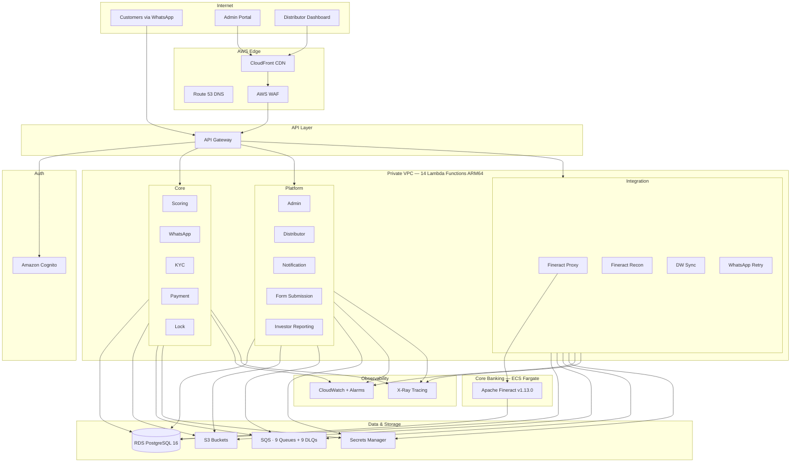

# Lynia Finance

**Financing for the productive majority.**

Credit infrastructure for Zimbabwe's underbanked majority, powered by AI/ML underwriting and enforced through technology. Regulated by the Reserve Bank of Zimbabwe.

## Vision

**The underbanked aren't high-risk—they're unmodeled.**

We're building the first credit system designed for the informal majority in Zimbabwe. 80% of Zimbabweans work in the informal sector with no payslips, no contracts, and no access to formal credit. Legacy credit models rely on collateral, employment history, and credit scores—none of which exist for the underbanked.

Lynia Finance is building a parallel financial system where credit decisions are made through alternative data, enforced through remote asset-lock technology, and repaid through mobile money rails integrated directly into income streams.

## The Problem

**Credit in Zimbabwe was never built for the informal majority**

- **80% informal workforce**: No payslips, no formal employment contracts, invisible to traditional lenders
- **76% informal businesses**: Unregistered, cash-based, and excluded from formal financing
- **Legacy lending broken**: Traditional models require collateral, employment verification, and credit history that don't exist

The informal economy isn't unproductive—it's simply unstructured and unmodeled by existing financial systems.

## Our Solution

**A new credit infrastructure: powered by data, enforced by tech**

1. **AI/ML Underwriting**: Assess affordability and repayment behavior without formal credit history, using alternative signals from mobile money behavior, location data, and social networks

2. **Enforceable Collateral**: Remote asset-lock technology enables asset-based lending at scale—smartphones and vehicles become productive collateral that can be locked/unlocked remotely

3. **Revenue-Linked Repayment**: Flexible payment collection that adapts to irregular income streams via mobile money integration (InnBucks, EcoCash, OneWallet, OMari), not rigid monthly schedules

4. **WhatsApp-First Platform**: Complete loan journey via WhatsApp—KYC submission, instant approval (<5 mins), asset selection, payment, and loan management with zero app downloads

## Architecture



**Backend**: AWS Lambda (Node.js 20/TypeScript, ARM64 Graviton2) — 14 functions
**Frontend**: Next.js 14, deployed via S3 + CloudFront
**Database**: RDS PostgreSQL 16 (encrypted, private VPC)
**Auth**: Amazon Cognito (admin + distributor user pools)
**Storage**: S3 (KYC docs, commission PDFs, reconciliation photos, ML models)
**Queues**: SQS (9 queues + 9 DLQs: notifications, payment-callbacks, kyc-processing, device-locks, whatsapp-message-retry, credit-scoring, fineract-sync-retry, dw-sync, payment-compensation)
**Core Banking**: Apache Fineract v1.13.0 on ECS Fargate
**Security**: WAF, Secrets Manager, VPC endpoints, X-Ray tracing
**CI/CD**: GitHub Actions (backend + frontend deployment pipelines)
**Integrations**: WhatsApp Cloud API, Smile Identity, InnBucks/EcoCash/OneWallet/OMari, Trustonic

See [docs/architecture/AWS-ARCHITECTURE.md](docs/architecture/AWS-ARCHITECTURE.md) for detailed diagrams and infrastructure reference.

## Project Structure

```
Lynia-finance/
├── services/                       # AWS Lambda microservices (14 functions)
│   ├── admin-service/              # Admin portal API (users, config, audit, products, devices, orgs, inventory)
│   ├── distributor-service/        # Distributor portal API (profile, stats, inventory, handovers, commissions)
│   ├── dw-sync-service/            # Data warehouse real-time sync
│   ├── fineract-proxy-service/     # Fineract core banking proxy (loans, products, GL, reports)
│   ├── form-submission-service/    # Public form capture (no auth)
│   ├── investor-reporting-service/ # Investor portfolio & covenant reporting
│   ├── kyc-service/                # Smile Identity / Didit KYC verification
│   ├── lock-service/               # Trustonic device lock management
│   ├── notification-service/       # Multi-channel notifications + reminder scheduling
│   ├── payment-service/            # Mobile money payments (InnBucks, EcoCash, OneWallet, OMari)
│   ├── pentaho-etl/                # Pentaho ETL jobs & transformations (config only)
│   ├── scoring-service/            # Hybrid AI/ML credit scoring (5-component model)
│   ├── whatsapp-service/           # WhatsApp bot conversation flow
│   └── shared/                     # Shared clients, types, utilities, lambda-router
│
├── frontend/                       # Web Applications
│   ├── admin-portal/               # Next.js 14 admin dashboard
│   └── distributor-dashboard/      # Next.js 14 distributor app
│
├── landing-page/                   # Marketing website (lyniafinance.com)
│
├── infrastructure/                 # Infrastructure as Code
│   └── aws/                        # 18 CloudFormation templates
│       ├── vpc.yaml                # VPC, subnets, NAT gateways
│       ├── rds.yaml                # RDS PostgreSQL 16
│       ├── cognito.yaml            # Cognito User Pools
│       ├── storage-buckets.yaml    # S3 buckets
│       ├── sqs-queues.yaml         # SQS queues + DLQs
│       ├── secrets-manager.yaml    # Secrets Manager
│       ├── waf.yaml                # WAF rules
│       ├── dns-ssl.yaml            # Route 53 + ACM certificates
│       ├── frontend-hosting.yaml   # S3 + CloudFront distributions
│       ├── fineract-ecs.yaml       # Fineract ECS Fargate service
│       ├── cloudwatch-alarms.yaml  # Monitoring + dashboards
│       ├── xray-tracing.yaml       # Distributed tracing
│       ├── canary-deployments.yaml # CodeDeploy canary config
│       ├── lambda-autoscaling.yaml # Reserved concurrency
│       ├── iam-roles.yaml          # Least-privilege IAM
│       └── production-master.yaml  # Orchestration template
│
├── database/                       # Database management
│   ├── migrations/                 # SQL migrations (001-018)
│   └── deploy-to-rds.sh           # RDS deployment script
│
├── fineract/                       # Apache Fineract v1.13.0 (core banking)
│   ├── modules/                    # Fineract modules
│   ├── custom/                     # Custom Lynia extensions
│   └── docker/                     # Docker configurations
│
├── openapi/                        # API Specification
│   └── lynia-finance-api.yaml      # OpenAPI 3.0 (51 endpoints)
│
├── Refactoring/                    # Refactoring documentation
│   ├── REFACTORING-STRATEGY.md     # 8-phase codebase modernization
│   └── POST-REFACTORING-RECOMMENDATIONS.md
│
├── config/                         # Environment parameters
├── docs/                           # Documentation
├── lynia-specs/                    # Specifications & requirements
├── .github/workflows/              # CI/CD pipelines
│   ├── deploy.yml                  # Backend Lambda deployment
│   └── deploy-frontend.yml         # Frontend S3/CloudFront deployment
└── template.yaml                   # AWS SAM master template (14 functions)
```

## Quick Start

### Prerequisites
- **Node.js 20+** - Lambda runtime
- **pnpm** - Package manager
- **AWS CLI** - Configured with credentials
- **AWS SAM CLI** - For local Lambda testing
- **Docker Desktop** - For local development
- **Git** - Version control

### Local Development

**1. Install Dependencies**
```bash
pnpm install
```

**2. Set Environment Variables**
```bash
cp .env.example .env
# Edit .env with your RDS, Cognito, and API credentials
```

**3. Build Lambda Functions**
```bash
sam build --parallel
```

**4. Run Local API**
```bash
sam local start-api --port 3000
```

**5. Test Endpoints**
```bash
node scripts/test-api-endpoints.js
```

### Deploy to AWS

**Staging**:
```bash
sam deploy --config-env staging
```

**Production**:
```bash
sam deploy --config-env production
```

See [DEPLOYMENT-GUIDE.md](DEPLOYMENT-GUIDE.md) for detailed deployment instructions.

### Run Demo

**1. Create Demo Data**
```bash
node scripts/create-demo-data.js
```

**2. Test API**
```bash
node scripts/test-api-endpoints.js
```

**3. View Demo Guide**
See [docs/DEMO-GUIDE.md](docs/DEMO-GUIDE.md) for complete demo walkthrough.

## Product Lines

### 1. Digital Credit — Conversational Liquidity
WhatsApp-native applications for instant, collateral-free credit. Target: civil servants and partner employees. Disbursement via mobile money (InnBucks, EcoCash, OneWallet, OMari).

### 2. Embedded Credit — API for Ecosystem Resilience
API-based infrastructure that analyzes mobile money activity to provide credit bundled with insurance and capacity-building. Serves retailers, distributors, employers, and platforms.

### 3. Asset-Backed Credit — Productive Asset Financing
IoT-based risk management substitutes traditional collateral with real-time asset telemetry. Starting with smartphones, scaling to gig-economy assets and vehicles.

## Core Features

### For Customers (WhatsApp Bot)
- WhatsApp-based KYC and instant loan approval (<5 mins)
- Browse devices and select repayment plans
- Mobile money payments (InnBucks, EcoCash, OneWallet, OMari)
- Loan management and smart reminders

### For Distributors
- Asset handover with ID verification
- Real-time inventory tracking
- Automated commission management
- Transaction history and reporting

### Admin Platform
- Financial reporting and KPIs
- Payment reconciliation
- Risk management and compliance
- ML model management

### Technology Stack
- AWS Lambda microservices (Node.js 20, ARM64) — 14 functions
- RDS PostgreSQL 16 (database)
- Amazon Cognito (authentication)
- S3 + CloudFront + WAF (storage, CDN, security)
- Apache Fineract v1.13.0 (core banking on ECS Fargate)
- WhatsApp Cloud API
- Hybrid AI/ML credit scoring

## Market Opportunity

**Starting narrow, scaling systemically**

Zimbabwe's informal sector represents a massive untapped market for alternative credit solutions. We're starting with device financing (phones as productive assets for informal workers) and expanding systematically.

**Product Roadmap**: Cell phone financing → Digital loans → Motorbike finance → Vehicle finance → Microfinance banking license → Regional expansion (Southern Africa)

## Key Differentiators

- Instant approval (<5 mins) via WhatsApp
- AI/ML underwriting for informal sector
- Remote asset-lock technology
- Mobile money integration (InnBucks, EcoCash, OneWallet, OMari)
- Scalable agent network distribution

## Business Model

**Dual-sided marketplace**: Borrowers ↔ Debt investors

**Revenue**: Interest income + Asset markup

**Distribution**: B2B2C partnerships + Commission-based agent network + WhatsApp viral growth

## Implementation Status

**Current Status**: Post-refactoring — production-ready architecture (Feb 2026)

### Platform Metrics

| Metric | Value |
|--------|-------|
| Lambda functions | 14 (TypeScript/Node.js 20.x, ARM64) |
| Database tables | 35+ (18 migrations) |
| API endpoints | 51 (OpenAPI 3.0 documented) |
| SQS queues | 9 + 9 DLQs |
| Test suites | 93 |
| Tests | 2,385 |
| Test coverage | 85%+ |
| Service READMEs | 12 |
| Deployment time | <10 minutes |

### Refactoring Achievements (Feb 2026)

A comprehensive 8-phase refactoring transformed the codebase:

- **Service decomposition**: 8 monolithic files (up to 3,306 lines) decomposed into 74 focused handler files using barrel re-export pattern
- **Lambda Router**: Declarative route-map pattern adopted across all services, replacing ad-hoc if/else routing chains
- **Structured logging**: Zero `console.*` calls — all 14 services use the shared structured logger with PII masking
- **Test expansion**: 29 → 93 suites (+64), 1,147 → 2,385 tests (+1,238), coverage from 35-40% to 85%+
- **TypeScript strict**: Zero TypeScript errors in both frontend apps; both build with `ignoreBuildErrors: false`
- **Bug fixes**: 2 critical payment bugs fixed (currency conversion, payment step trigger)
- **Documentation**: 12 service READMEs, OpenAPI 3.0 spec with 51 endpoints, 27 standardized error codes

### Completed Infrastructure

- 14 AWS Lambda microservices (12 services + 2 support functions)
- Apache Fineract v1.13.0 on ECS Fargate (core banking)
- RDS PostgreSQL 16 (35+ tables, encrypted, private VPC)
- Amazon Cognito (admin + distributor user pools, 5 groups)
- S3 storage (4 buckets), SQS (9 queues + 9 DLQs)
- 18 CloudFormation templates, WAF, X-Ray tracing
- CI/CD via GitHub Actions (backend + frontend pipelines)
- Admin Portal & Distributor Dashboard (Next.js 14)

### Planned

- Regional expansion infrastructure (Southern Africa)
- Additional payment provider integrations
- ML model v2 deployment

See [plan.md](lynia-specs/lynia-lending/plan.md) for full roadmap.

## Version Information

- Node.js: 20 LTS | TypeScript | Next.js: 14 | Python: 3.11 (ML)
- Apache Fineract: v1.13.0 (Java 17, Gradle 8.x, Spring Boot 3.x)
- AWS: SAM CLI, CloudFormation, us-east-1

## Documentation

### Architecture & Infrastructure
- **AWS Architecture**: [docs/architecture/AWS-ARCHITECTURE.md](docs/architecture/AWS-ARCHITECTURE.md)
- **Network Architecture**: [docs/infrastructure/PRODUCTION-NETWORK-ARCHITECTURE.md](docs/infrastructure/PRODUCTION-NETWORK-ARCHITECTURE.md)
- **AWS Setup Guide**: [docs/deployment/AWS-SETUP-GUIDE.md](docs/deployment/AWS-SETUP-GUIDE.md)
- **System Flows**: [docs/SYSTEM-FLOWS.md](docs/SYSTEM-FLOWS.md)
- **Refactoring Strategy**: [Refactoring/REFACTORING-STRATEGY.md](Refactoring/REFACTORING-STRATEGY.md)

### Specifications
- **Spec**: [spec.md](lynia-specs/lynia-lending/spec.md) | **Plan**: [plan.md](lynia-specs/lynia-lending/plan.md) | **Tasks**: [tasks.md](lynia-specs/lynia-lending/tasks.md)

### Deployment & Operations
- **Deployment Guide**: [DEPLOYMENT-GUIDE.md](DEPLOYMENT-GUIDE.md)
- **CI/CD Pipeline**: [.github/workflows/deploy.yml](.github/workflows/deploy.yml)
- **Migration Report**: [docs/SUPABASE-TO-AWS-MIGRATION-REPORT.md](docs/SUPABASE-TO-AWS-MIGRATION-REPORT.md)

### API & Service Documentation
- **OpenAPI Specification**: [openapi/lynia-finance-api.yaml](openapi/lynia-finance-api.yaml)
- **Admin Service**: [services/admin-service/](services/admin-service/)
- **Distributor Service**: [services/distributor-service/](services/distributor-service/)
- **WhatsApp Service**: [services/whatsapp-service/](services/whatsapp-service/)
- **Scoring Service**: [services/scoring-service/](services/scoring-service/)
- **KYC Service**: [services/kyc-service/](services/kyc-service/)
- **Payment Service**: [services/payment-service/](services/payment-service/)
- **Lock Service**: [services/lock-service/](services/lock-service/)
- **Notification Service**: [services/notification-service/](services/notification-service/)
- **Fineract Proxy**: [services/fineract-proxy-service/](services/fineract-proxy-service/)
- **Investor Reporting**: [services/investor-reporting-service/](services/investor-reporting-service/)
- **Form Submission**: [services/form-submission-service/](services/form-submission-service/)
- **DW Sync**: [services/dw-sync-service/](services/dw-sync-service/)

### Apache Fineract (Core Banking)
- **Fineract README**: [fineract/README.md](fineract/README.md)
- **Setup Guide**: [docs/Apache_Fineract_Setup_Guide.pdf](docs/Apache_Fineract_Setup_Guide.pdf)
- **v1.13 Highlights**: [docs/FINERACT_V1.13_HIGHLIGHTS.md](docs/FINERACT_V1.13_HIGHLIGHTS.md)

### Demo & Presentation
- **Demo Guide**: [docs/DEMO-GUIDE.md](docs/DEMO-GUIDE.md)
- **Demo Scripts**: [scripts/create-demo-data.js](scripts/create-demo-data.js)
- **API Testing**: [scripts/test-api-endpoints.js](scripts/test-api-endpoints.js)

## License

- Apache Fineract: Apache License 2.0
- Lynia Finance: Proprietary

---

## Testing

### Unit Tests
```bash
pnpm test
```

### Integration Tests
```bash
pnpm test:integration
```

### API Endpoint Tests
```bash
node scripts/test-api-endpoints.js
```

### Local Lambda Testing
```bash
# Test specific function
sam local invoke ScoringFunction --event events/test-scoring-calculate.json

# Start local API
sam local start-api --port 3000
```

---

## Demo Scenarios

### Scenario 1: Successful Onboarding
Zimbabwe customer completes full 8-step onboarding, gets approved (Tier 2, $350 limit), pays deposit via EcoCash, picks up device.

### Scenario 2: Non-Zimbabwe Rejection
Customer with Kenya number (+254) tries to register, system rejects appropriately, added to international waitlist.

### Scenario 3: Manual Review
Borderline credit score (640) triggers manual admin review, admin approves with adjusted limit.

### Scenario 4: Payment & Lock
Customer misses payment, device automatically locks after 7 days, customer pays, device unlocks automatically.

**Run All Demo Scenarios**:
```bash
node scripts/create-demo-data.js
```

See [DEMO-GUIDE.md](docs/DEMO-GUIDE.md) for detailed walkthrough.

---

## Contributing

This is a proprietary project. For access or collaboration inquiries, contact the team.

---

**Last Updated**: 2026-02-27 | **Status**: Post-refactoring, production-ready | **Next**: Regional expansion
