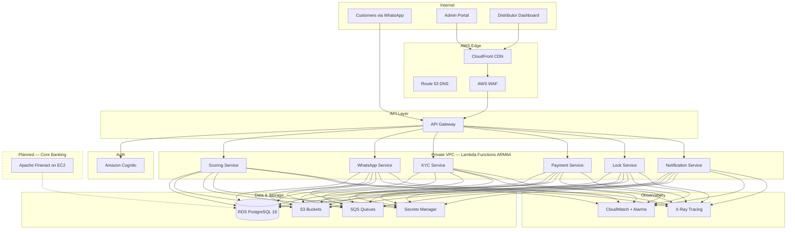

# Lynia Finance

**Alternative financial rails to power financial mobility**

A new credit infrastructure for Zimbabwe's underbanked majority, powered by AI/ML underwriting and enforced by technology.

## Vision

**The underbanked aren't high-risk—they're unmodeled.**

We're building the first credit system designed for the informal majority in Zimbabwe. 80% of Zimbabweans work in the informal sector with no payslips, no contracts, and no access to formal credit. Legacy credit models rely on collateral, employment history, and credit scores—none of which exist for the underbanked.

Lynia Finance is building a parallel financial system where credit decisions are made through alternative data, enforced through remote asset-lock technology, and repaid through mobile money rails integrated directly into income streams.

## The Problem

**Credit in Zimbabwe was never built for the informal majority**

- **80% informal workforce**: No payslips, no formal employment contracts, invisible to traditional lenders
- **76% informal businesses**: Unregistered, cash-based, and excluded from formal financing
- **Legacy lending broken**: Traditional models require collateral, employment verification, and credit history that don't exist

The informal economy isn't unproductive—it's simply unstructured and unmodeled by existing financial systems.

## Our Solution

**A new credit infrastructure: powered by data, enforced by tech**

1. **AI/ML Underwriting**: Assess affordability and repayment behavior without formal credit history, using alternative signals from mobile money behavior, location data, and social networks

2. **Enforceable Collateral**: Remote asset-lock technology enables asset-based lending at scale—smartphones and vehicles become productive collateral that can be locked/unlocked remotely

3. **Revenue-Linked Repayment**: Flexible payment collection that adapts to irregular income streams via mobile money integration (EcoCash, Omari), not rigid monthly schedules

4. **WhatsApp-First Platform**: Complete loan journey via WhatsApp—KYC submission, instant approval (<5 mins), asset selection, payment, and loan management with zero app downloads

## Architecture



**Backend**: AWS Lambda (Node.js 20/TypeScript, ARM64 Graviton2)
**Frontend**: Next.js 14, deployed via S3 + CloudFront
**Database**: RDS PostgreSQL 16 (encrypted, private VPC)
**Auth**: Amazon Cognito (admin + distributor user pools)
**Storage**: S3 (KYC docs, commission PDFs, reconciliation photos, ML models)
**Queues**: SQS (5 queues with DLQ: notifications, payments, KYC, device locks, credit scoring)
**Security**: WAF, Secrets Manager, VPC endpoints, X-Ray tracing
**Core Banking** *(planned)*: Apache Fineract v1.13.0 on EC2 t3.micro
**CI/CD**: GitHub Actions (backend + frontend deployment pipelines)
**Integrations**: WhatsApp Cloud API, Smile Identity, EcoCash/OneMoney, Trustonic

**Estimated Cost**: $154-262/month (production) | $90-160/month (staging)

See [docs/architecture/AWS-ARCHITECTURE.md](docs/architecture/AWS-ARCHITECTURE.md) for detailed diagrams and infrastructure reference.

## Project Structure

```
Lynia-finance/
├── services/                       # AWS Lambda microservices
│   ├── scoring-service/            # Hybrid credit scoring (AI/ML)
│   ├── whatsapp-service/           # WhatsApp bot conversation flow
│   ├── kyc-service/                # Smile Identity KYC integration
│   ├── payment-service/            # EcoCash/OneMoney payment gateway
│   ├── lock-service/               # Trustonic device lock management
│   ├── notification-service/       # Multi-channel notifications
│   └── shared/                     # Shared clients, types, utilities
│
├── frontend/                       # Web Applications
│   ├── admin-portal/               # Next.js 14 admin dashboard
│   └── distributor-dashboard/      # Next.js 14 distributor app
│
├── landing-page/                   # Marketing website
│
├── infrastructure/                 # Infrastructure as Code
│   └── aws/                        # 16 CloudFormation templates
│       ├── vpc.yaml                # VPC, subnets, NAT gateways
│       ├── rds.yaml                # RDS PostgreSQL 16
│       ├── cognito.yaml            # Cognito User Pools
│       ├── storage-buckets.yaml    # S3 buckets
│       ├── sqs-queues.yaml         # SQS queues + DLQs
│       ├── secrets-manager.yaml    # Secrets Manager
│       ├── waf.yaml                # WAF rules
│       ├── dns-ssl.yaml            # Route 53 + ACM certificates
│       ├── frontend-hosting.yaml   # S3 + CloudFront distributions
│       ├── cloudwatch-alarms.yaml  # Monitoring + dashboards
│       ├── xray-tracing.yaml       # Distributed tracing
│       ├── canary-deployments.yaml # CodeDeploy canary config
│       ├── lambda-autoscaling.yaml # Reserved concurrency
│       ├── iam-roles.yaml          # Least-privilege IAM
│       └── production-master.yaml  # Orchestration template
│
├── database/                       # Database management
│   ├── migrations/                 # SQL migrations (001-018)
│   └── deploy-to-rds.sh           # RDS deployment script
│
├── fineract/                       # Apache Fineract v1.13.0 (core banking, planned deployment)
│   ├── modules/                    # Fineract modules
│   ├── custom/                     # Custom Lynia extensions
│   └── docker/                     # Docker configurations
│
├── config/                         # Environment parameters
├── docs/                           # Documentation
├── lynia-specs/                    # Specifications & requirements
├── .github/workflows/              # CI/CD pipelines
│   ├── deploy.yml                  # Backend Lambda deployment
│   └── deploy-frontend.yml         # Frontend S3/CloudFront deployment
└── template.yaml                   # AWS SAM master template
```

## Quick Start

### Prerequisites
- **Node.js 20+** - Lambda runtime
- **pnpm** - Package manager
- **AWS CLI** - Configured with credentials
- **AWS SAM CLI** - For local Lambda testing
- **Docker Desktop** - For local development
- **Git** - Version control

### Local Development

**1. Install Dependencies**
```bash
pnpm install
```

**2. Set Environment Variables**
```bash
cp .env.example .env
# Edit .env with your RDS, Cognito, and API credentials
```

**3. Build Lambda Functions**
```bash
sam build --parallel
```

**4. Run Local API**
```bash
sam local start-api --port 3000
```

**5. Test Endpoints**
```bash
node scripts/test-api-endpoints.js
```

### Deploy to AWS

**Staging**:
```bash
sam deploy --config-env staging
```

**Production**:
```bash
sam deploy --config-env production
```

See [DEPLOYMENT-GUIDE.md](DEPLOYMENT-GUIDE.md) for detailed deployment instructions.

### Run Demo

**1. Create Demo Data**
```bash
node scripts/create-demo-data.js
```

**2. Test API**
```bash
node scripts/test-api-endpoints.js
```

**3. View Demo Guide**
See [docs/DEMO-GUIDE.md](docs/DEMO-GUIDE.md) for complete demo walkthrough.

## Core Features

### For Customers (WhatsApp Bot)
- WhatsApp-based KYC and instant loan approval (<5 mins)
- Browse devices and select repayment plans
- Mobile money payments (EcoCash, Omari)
- Loan management and smart reminders

### For Distributors
- Asset handover with ID verification
- Real-time inventory tracking
- Automated commission management
- Transaction history and reporting

### Admin Platform
- Financial reporting and KPIs
- Payment reconciliation
- Risk management and compliance
- ML model management

### Technology Stack
- AWS Lambda microservices (Node.js 20, ARM64)
- RDS PostgreSQL 16 (database)
- Amazon Cognito (authentication)
- S3 + CloudFront + WAF (storage, CDN, security)
- Apache Fineract v1.13.0 (core banking — planned EC2 deployment)
- WhatsApp Cloud API
- Hybrid AI/ML credit scoring

## Market Opportunity

**Starting narrow, scaling systemically**

Zimbabwe's informal sector represents a massive untapped market for alternative credit solutions. We're starting with device financing (phones as productive assets for informal workers) and expanding systematically.

**Product Roadmap**: Cell phone financing → Digital loans → Motorbike finance → Vehicle finance → Microfinance banking license → Regional expansion (Southern Africa)

## Key Differentiators

- Instant approval (<5 mins) via WhatsApp
- AI/ML underwriting for informal sector
- Remote asset-lock technology
- Mobile money integration
- Scalable agent network distribution

## Business Model

**Dual-sided marketplace**: Borrowers ↔ Debt investors

**Revenue**: Interest income + Asset markup

**Distribution**: B2B2C partnerships + Commission-based agent network + WhatsApp viral growth

## Implementation Status

**Current Status**: AWS-native architecture — Supabase migration complete (Feb 2026)

### Completed
- 6 AWS Lambda microservices (TypeScript/Node.js 20.x, ARM64)
- RDS PostgreSQL 16 database schema (35+ tables, 18 migrations)
- Amazon Cognito authentication (admin + distributor clients)
- S3 storage (4 buckets: KYC docs, commissions, reconciliation, ML models)
- 16 CloudFormation templates for full infrastructure
- CI/CD pipelines (GitHub Actions)
- Deployment automation (AWS SAM + CodeDeploy canary)
- WAF, X-Ray tracing, CloudWatch monitoring
- Testing infrastructure (Jest + Supertest, 80%+ coverage)
- Admin Portal & Distributor Dashboard (Next.js 14)
- Demo scenarios & test data

**Key Metrics**:
- Services: 6 Lambda functions
- Database tables: 35+
- API endpoints: 45+
- Test coverage: 80%+
- Deployment time: <10 minutes

### Planned
- Apache Fineract deployment on EC2 (core banking engine)
- Fineract ↔ Lambda service integration
- Regional expansion infrastructure

See [plan.md](lynia-specs/lynia-lending/plan.md) for full roadmap.

## Version Information

- Node.js: 20 LTS | TypeScript | Next.js: 14 | Python: 3.11 (ML)
- Apache Fineract: v1.13.0 (Java 17, Gradle 8.x, Spring Boot 3.x)
- AWS: SAM CLI, CloudFormation, us-east-1

## Documentation

### Architecture & Infrastructure
- **AWS Architecture**: [docs/architecture/AWS-ARCHITECTURE.md](docs/architecture/AWS-ARCHITECTURE.md)
- **Network Architecture**: [docs/infrastructure/PRODUCTION-NETWORK-ARCHITECTURE.md](docs/infrastructure/PRODUCTION-NETWORK-ARCHITECTURE.md)
- **AWS Setup Guide**: [docs/deployment/AWS-SETUP-GUIDE.md](docs/deployment/AWS-SETUP-GUIDE.md)
- **System Flows**: [docs/SYSTEM-FLOWS.md](docs/SYSTEM-FLOWS.md)

### Specifications
- **Spec**: [spec.md](lynia-specs/lynia-lending/spec.md) | **Plan**: [plan.md](lynia-specs/lynia-lending/plan.md) | **Tasks**: [tasks.md](lynia-specs/lynia-lending/tasks.md)

### Deployment & Operations
- **Deployment Guide**: [DEPLOYMENT-GUIDE.md](DEPLOYMENT-GUIDE.md)
- **CI/CD Pipeline**: [.github/workflows/deploy.yml](.github/workflows/deploy.yml)
- **Migration Report**: [docs/SUPABASE-TO-AWS-MIGRATION-REPORT.md](docs/SUPABASE-TO-AWS-MIGRATION-REPORT.md)

### Apache Fineract (Core Banking)
- **Fineract README**: [fineract/README.md](fineract/README.md)
- **Setup Guide**: [docs/Apache_Fineract_Setup_Guide.pdf](docs/Apache_Fineract_Setup_Guide.pdf)
- **v1.13 Highlights**: [docs/FINERACT_V1.13_HIGHLIGHTS.md](docs/FINERACT_V1.13_HIGHLIGHTS.md)

### Service Documentation
- **WhatsApp Service**: [services/whatsapp-service/](services/whatsapp-service/)
- **Scoring Service**: [services/scoring-service/](services/scoring-service/)
- **KYC Service**: [services/kyc-service/](services/kyc-service/)
- **Payment Service**: [services/payment-service/](services/payment-service/)
- **Lock Service**: [services/lock-service/](services/lock-service/)
- **Notification Service**: [services/notification-service/](services/notification-service/)

### Demo & Presentation
- **Demo Guide**: [docs/DEMO-GUIDE.md](docs/DEMO-GUIDE.md)
- **Demo Scripts**: [scripts/create-demo-data.js](scripts/create-demo-data.js)
- **API Testing**: [scripts/test-api-endpoints.js](scripts/test-api-endpoints.js)

## License

- Apache Fineract: Apache License 2.0
- Lynia Finance: Proprietary

---

## Testing

### Unit Tests
```bash
pnpm test
```

### Integration Tests
```bash
pnpm test:integration
```

### API Endpoint Tests
```bash
node scripts/test-api-endpoints.js
```

### Local Lambda Testing
```bash
# Test specific function
sam local invoke ScoringFunction --event events/test-scoring-calculate.json

# Start local API
sam local start-api --port 3000
```

---

## Demo Scenarios

### Scenario 1: Successful Onboarding
Zimbabwe customer completes full 8-step onboarding, gets approved (Tier 2, $350 limit), pays deposit via EcoCash, picks up device.

### Scenario 2: Non-Zimbabwe Rejection
Customer with Kenya number (+254) tries to register, system rejects appropriately, added to international waitlist.

### Scenario 3: Manual Review
Borderline credit score (640) triggers manual admin review, admin approves with adjusted limit.

### Scenario 4: Payment & Lock
Customer misses payment, device automatically locks after 7 days, customer pays, device unlocks automatically.

**Run All Demo Scenarios**:
```bash
node scripts/create-demo-data.js
```

See [DEMO-GUIDE.md](docs/DEMO-GUIDE.md) for detailed walkthrough.

---

## Contributing

This is a proprietary project. For access or collaboration inquiries, contact the team.

---

**Last Updated**: 2026-02-13 | **Status**: AWS-native architecture complete | **Next**: Fineract EC2 deployment
