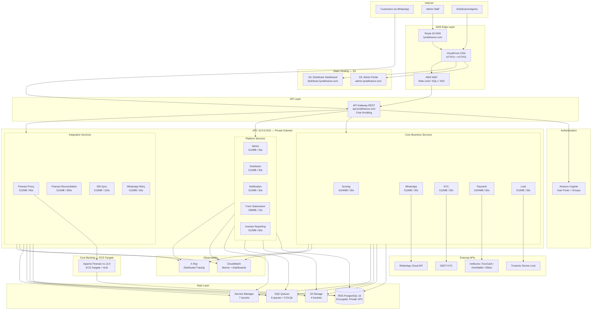
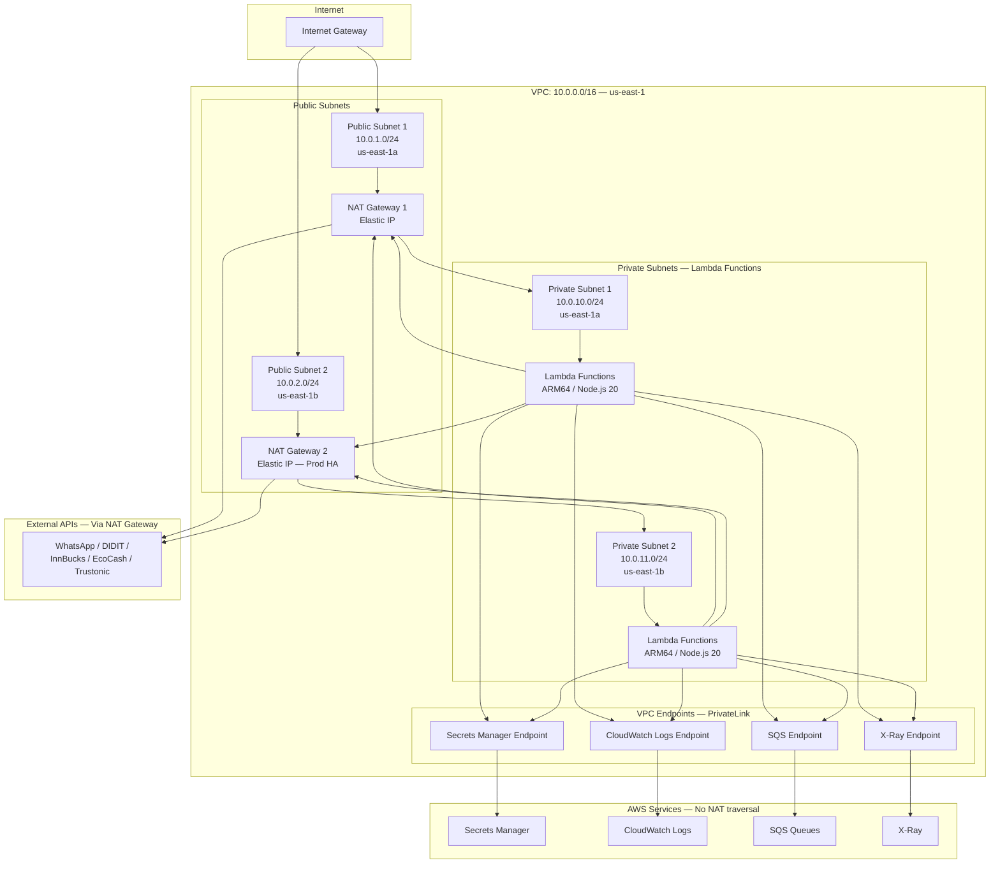
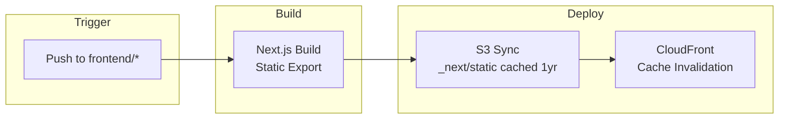
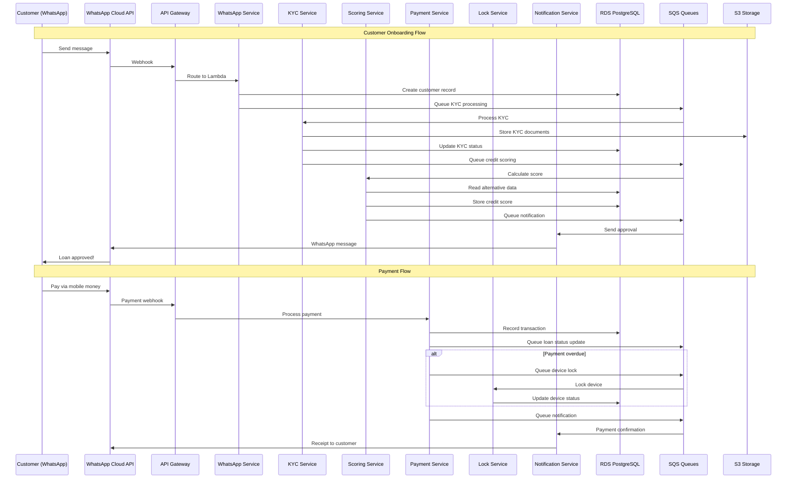

# Lynia Finance - AWS Architecture

**Last Updated**: 2026-03-05

This document provides comprehensive architecture diagrams and infrastructure reference
for the Lynia Finance AWS-native platform.

---

## 1. High-Level System Architecture



---

## 2. VPC Network Topology



**Security Groups:**

| Security Group | Inbound | Outbound |
|---------------|---------|----------|
| Lambda SG | None | HTTPS (443) to 0.0.0.0/0, PostgreSQL (5432) to RDS SG |
| VPC Endpoint SG | HTTPS (443) from Lambda SG | None |
| RDS SG | PostgreSQL (5432) from Lambda SG | None |

---

## 3. CI/CD Pipeline

```mermaid
graph LR
    subgraph Trigger
        Push[Git Push to master]
        Manual[Manual Dispatch]
    end

    subgraph Stage1["Stage 1: Quality"]
        Lint[ESLint]
        Test[Jest Tests<br/>85%+ coverage]
        Coverage[Codecov Upload]
    end

    subgraph Stage2["Stage 2: Security"]
        Audit[pnpm audit]
        Secrets[Secrets Detection]
        CfnLint[CloudFormation Lint]
    end

    subgraph Stage3["Stage 3: Build & Deploy"]
        Build[SAM Build<br/>esbuild / ARM64 / ES2022]
        Deploy[SAM Deploy<br/>CloudFormation Changeset]
        Canary[CodeDeploy Canary<br/>10% traffic shift]
    end

    subgraph Verify
        Alarm[CloudWatch Alarms]
        Rollback[Auto-Rollback<br/>on failure]
        Complete[Full Traffic Shift]
    end

    Push & Manual --> Lint --> Test --> Coverage
    Coverage --> Audit --> Secrets --> CfnLint
    CfnLint --> Build --> Deploy --> Canary
    Canary --> Alarm
    Alarm -->|Healthy| Complete
    Alarm -->|Unhealthy| Rollback
```



### Frontend Pipeline



### CloudFront Function — SPA Dynamic Route Support

Both frontend CloudFront distributions use a **viewer-request CloudFront Function** (`{environment}-lynia-directory-index`) that handles two concerns:

1. **UUID dynamic route rewriting**: Next.js static export generates pages at placeholder paths (e.g., `/products/_/index.html` via `generateStaticParams`). The CloudFront Function rewrites UUID path segments to `_` so that requests like `/products/550e8400-e29b-41d4-a716-446655440000/` resolve to the correct static page.

2. **Directory index rewriting**: Appends `index.html` to directory paths (e.g., `/products/` → `/products/index.html`) and extensionless paths (e.g., `/dashboard` → `/dashboard/index.html`).

```javascript
// infrastructure/aws/cloudfront-functions/directory-index.js
function handler(event) {
  var request = event.request;
  var uri = request.uri;
  // Replace UUID path segments with '_' for Next.js dynamic routes
  uri = uri.replace(/\/[0-9a-f]{8}-[0-9a-f]{4}-[0-9a-f]{4}-[0-9a-f]{4}-[0-9a-f]{12}(\/|$)/gi, '/_$1');
  // Standard directory index rewrite
  if (uri.endsWith('/')) uri += 'index.html';
  else if (uri.indexOf('.') === -1) uri += '/index.html';
  request.uri = uri;
  return request;
}
```

This works in conjunction with the `CustomErrorResponses` in `frontend-hosting.yaml` which redirects S3 403/404 errors to `/index.html` as a fallback for client-side routing.

**Canary Deployment Strategy:**

| Service | Strategy | Wait Period | Rollback Trigger |
|---------|----------|-------------|-----------------|
| Payment | Canary 10% | 30 minutes | CloudWatch alarm |
| Scoring | Canary 10% | 15 minutes | CloudWatch alarm |
| WhatsApp | Canary 10% | 15 minutes | CloudWatch alarm |
| KYC / Lock / Notification | Linear 10% | 1 minute | CloudWatch alarm |

---

## 4. Service Communication & Data Flow



---

## 5. Architecture Patterns

### API Gateway CORS Configuration

CORS is configured at three levels to support all HTTP methods used by the frontend:

1. **API-level** (`template.yaml` Globals → Api → Cors): `AllowMethods: GET,POST,PUT,PATCH,DELETE,OPTIONS`
2. **Gateway Responses** (`DEFAULT_4XX`, `DEFAULT_5XX`): Include CORS headers so error responses don't trigger browser CORS failures
3. **Lambda response headers** (`services/shared/utils/response.ts`): Every Lambda response includes `Access-Control-Allow-Methods` with all methods

All three must be in sync. Missing a method (e.g., PATCH) at any level causes the browser to reject the preflight OPTIONS response with "Failed to fetch".

### Lambda Router

All 14 Lambda functions use the shared `createRouter()` utility (`services/shared/utils/lambda-router.ts`) for declarative request routing. This replaced ad-hoc if/else chains across all services during the Feb 2026 refactoring.

Key features: automatic OPTIONS/CORS handling, parameterized path extraction (`/users/:id`), auth context injection, structured error responses (404/405/500), and request logging.

See [services/README.md](../../services/README.md) for full documentation and migration examples.

### Barrel Re-export for Backwards Compatibility

When large files were decomposed during refactoring, the original file became a thin re-export barrel. This prevents breaking any existing imports:

```typescript
// services/shared/fineract-rbz-reporting.ts (was 1,772 lines, now 7)
export * from './rbz-reporting/index';
```

Eight monolithic files (up to 3,306 lines) were decomposed into 74 focused handler files using this pattern.

### Structured Logging with PII Masking

All 14 services use the shared logger (`services/shared/utils/logger.ts`). Zero `console.*` calls exist in service source code. The logger automatically masks phone numbers, national IDs, passwords, and other PII before writing to CloudWatch.

```typescript
// PII is masked automatically
logger.info({
  action: 'kyc.verify',
  phone: '+263****567',     // auto-masked from full number
  nationalId: '12******90', // auto-masked from full ID
});
```

---

## Infrastructure Reference

### CloudFormation Templates

| # | Template | Purpose | Layer |
|---|----------|---------|-------|
| 1 | `vpc.yaml` | VPC, subnets, NAT gateways, internet gateway | Foundation |
| 2 | `rds.yaml` | RDS PostgreSQL 16, encryption, auto-scaling | Foundation |
| 3 | `cognito.yaml` | User Pool, 2 app clients, 5 groups | Foundation |
| 4 | `secrets-manager.yaml` | 7 secrets with least-privilege IAM | Foundation |
| 5 | `sqs-queues.yaml` | 9 queues + 9 DLQs, long polling | Foundation |
| 6 | `storage-buckets.yaml` | 4 S3 buckets (KYC, commissions, reconciliation, ML) | Foundation |
| 7 | `iam-roles.yaml` | Lambda execution roles, CI/CD roles | Foundation |
| 8 | `dns-ssl.yaml` | Route 53 records, ACM certificates | Configuration |
| 9 | `waf.yaml` | WAFv2 with 8 rules | Configuration |
| 10 | `api-gateway/throttling-usage-plans.yaml` | 3-tier throttling, 5 API keys | Configuration |
| 11 | `xray-tracing.yaml` | Sampling rules, trace groups | Configuration |
| 12 | `template.yaml` (SAM) | 14 Lambda functions + API Gateway | Application |
| 13 | `frontend-hosting.yaml` | S3 + CloudFront (admin + distributor) | Application |
| 14 | `fineract-ecs.yaml` | Fineract ECS Fargate service + ALB | Application |
| 15 | `cloudwatch-alarms.yaml` | 12 alarms, 3 dashboards, SNS topics | Operations |
| 16 | `canary-deployments.yaml` | CodeDeploy canary config | Operations |
| 17 | `lambda-autoscaling.yaml` | Reserved concurrency + auto-scaling | Operations |
| 18 | `production-master.yaml` | Orchestration template | Orchestration |

### Lambda Functions

| Service | Function Name | Memory | Timeout | Purpose |
|---------|---------------|--------|---------|---------|
| Scoring | scoring-service | 1024 MB | 30s | Credit scoring (5-component model) |
| WhatsApp | whatsapp-service | 512 MB | 30s | WhatsApp bot conversation flow |
| WhatsApp Retry | whatsapp-retry | 512 MB | 30s | Failed message retry (SQS consumer) |
| KYC | kyc-service | 512 MB | 30s | Identity verification |
| Payment | payment-service | 1024 MB | 60s | Payment processing |
| Lock | lock-service | 512 MB | 30s | Device lock/unlock |
| Notification | notification-service | 512 MB | 30s | Multi-channel notifications |
| Form Submission | form-submission | 256 MB | 15s | Public form capture |
| Fineract Reconciliation | fineract-reconciliation | 512 MB | 300s | Fineract data reconciliation |
| Fineract Proxy | fineract-proxy | 512 MB | 60s | Core banking API proxy |
| Admin | admin-service | 512 MB | 30s | Admin portal API (users, config, products, devices, inventory, distributors, KYC, dashboard) |
| Distributor | distributor-service | 512 MB | 30s | Distributor portal API |
| Investor Reporting | investor-reporting | 512 MB | 60s | Investor portfolio reports |
| DW Sync | dw-sync | 512 MB | 120s | Data warehouse sync |

- **Runtime**: Node.js 20.x on ARM64 (Graviton2)
- **X-Ray**: Active on all functions
- **Deployment**: Canary via CodeDeploy

### SQS Queues

| Queue | Visibility Timeout | Retention | Max Retries | DLQ Retention |
|-------|-------------------|-----------|-------------|---------------|
| notifications | 60s | 4 days | 3 | 14 days |
| payment-callbacks | 120s | 4 days | 5 | 14 days |
| kyc-processing | 120s | 4 days | 3 | 14 days |
| device-locks | 90s | 4 days | 3 | 14 days |
| whatsapp-message-retry | 60s | 4 days | 5 | 14 days |
| credit-scoring | 90s | 4 days | 3 | 14 days |
| fineract-sync-retry | 120s | 7 days | 5 | 14 days |
| dw-sync | 120s | 4 days | 5 | 14 days |
| payment-compensation | 300s | 7 days | 3 | 14 days |

- Long polling: 20s wait time
- DLQ alarm: Alert when any DLQ receives messages

### S3 Buckets

| Bucket | Purpose | Access |
|--------|---------|--------|
| `lynia-{env}-kyc-documents` | KYC photos, ID scans | Signed URLs (15min expiry) |
| `lynia-{env}-commission-pdfs` | Distributor commission reports | Signed URLs |
| `lynia-{env}-reconciliation` | Payment reconciliation photos | Signed URLs |
| `lynia-{env}-ml-models` | Credit scoring ML model artifacts | Lambda read-only |

### Cognito User Groups

| Group | Purpose | Dashboard Access |
|-------|---------|-----------------|
| `admin` | Full system access | Admin Portal |
| `manager` | Loan approval, reports | Admin Portal |
| `support` | Customer support, read-only | Admin Portal |
| `reports_viewer` | Read-only dashboard access | Admin Portal |
| `distributor` | Device handover, inventory | Distributor Dashboard |

### X-Ray Tracing Sampling

| Service | Sample Rate |
|---------|------------|
| Payment | 100% (all transactions) |
| KYC | 50% |
| Scoring | 25% |
| Default | 5% |

---

## Deployment Order

Stacks must be deployed in this sequence:

1. **VPC** (`vpc.yaml`)
2. **Secrets Manager** (`secrets-manager.yaml`)
3. **SQS Queues** (`sqs-queues.yaml`)
4. **RDS** (`rds.yaml`)
5. **Cognito** (`cognito.yaml`)
6. **Storage Buckets** (`storage-buckets.yaml`)
7. **IAM Roles** (`iam-roles.yaml`)
8. **DNS/SSL** (`dns-ssl.yaml`) — 10-30 min for certificate validation
9. **Application** (`template.yaml`) — Lambda + API Gateway
10. **Fineract ECS** (`fineract-ecs.yaml`) — Core banking service
11. **WAF** (`waf.yaml`)
12. **API Gateway Throttling** (`throttling-usage-plans.yaml`)
13. **X-Ray** (`xray-tracing.yaml`)
14. **Monitoring** (`cloudwatch-alarms.yaml`)
15. **Canary Deployments** (`canary-deployments.yaml`)
16. **Frontend Hosting** (`frontend-hosting.yaml`)
17. **Lambda Auto-Scaling** (`lambda-autoscaling.yaml`)

Orchestrated by `production-master.yaml` or `infrastructure/aws/scripts/deploy-infrastructure.sh`.

---

## Cost Estimate

| Service | Monthly Cost |
|---------|-------------|
| Lambda (14 functions, ARM64) | $15-50 |
| API Gateway | $10-30 |
| NAT Gateway (2x HA for prod) | $64 |
| VPC Endpoints (4x) | $28 |
| RDS PostgreSQL (db.t3.micro) | $15-30 |
| ECS Fargate (Fineract) | $20-40 |
| CloudFront (2 distributions) | $10-30 |
| S3 (frontend + storage) | $1-5 |
| Secrets Manager (7 secrets) | $3 |
| SQS (9 queues) | $1-5 |
| CloudWatch (dashboards + alarms) | $10-20 |
| WAF | $5-15 |
| Route 53 | $2 |
| X-Ray | $5-10 |
| **Total (Production)** | **$174-302/month** |
| **Total (Staging)** | **$110-190/month** |

---

## Apache Fineract — Core Banking (ECS Fargate)

Apache Fineract v1.13.0 serves as the core banking engine for loan lifecycle
management, repayment scheduling, and accounting.

**Current Status**: Deployed on ECS Fargate (`production-lynia-fineract-ecs` stack).

**Architecture**:
- ECS Fargate service with Application Load Balancer
- Connected to RDS PostgreSQL (fineract_tenants + fineract_default schemas)
- Monitoring via `production-lynia-fineract-monitoring` stack (dashboard + 6 alarms)
- Accessed by Lambda services through the Fineract Proxy service

**Related Lambda Functions**:
- `fineract-proxy` (512MB / 60s): Routes API requests to Fineract — loans, products, GL accounts, reports, reconciliation
- `fineract-reconciliation` (512MB / 300s): Periodic reconciliation between Lynia and Fineract data

**Fineract Resources**:
- Source code: `fineract/`
- Custom extensions: `fineract/custom/acme/`
- Docker configs: `fineract/docker-compose-postgresql.yml`
- Testing guide: `research/guides/FINERACT-TESTING-GUIDE.md`

---

## Related Documentation

- [Production Network Architecture](../infrastructure/PRODUCTION-NETWORK-ARCHITECTURE.md) — Detailed VPC topology
- [AWS Setup Guide](../deployment/AWS-SETUP-GUIDE.md) — RDS, Cognito, S3 deployment steps
- [Supabase to AWS Migration Report](../SUPABASE-TO-AWS-MIGRATION-REPORT.md) — Migration details
- [Refactoring Strategy](../../Refactoring/REFACTORING-STRATEGY.md) — 8-phase codebase modernization
- [OpenAPI Specification](../../openapi/lynia-finance-api.yaml) — 51 API endpoints
